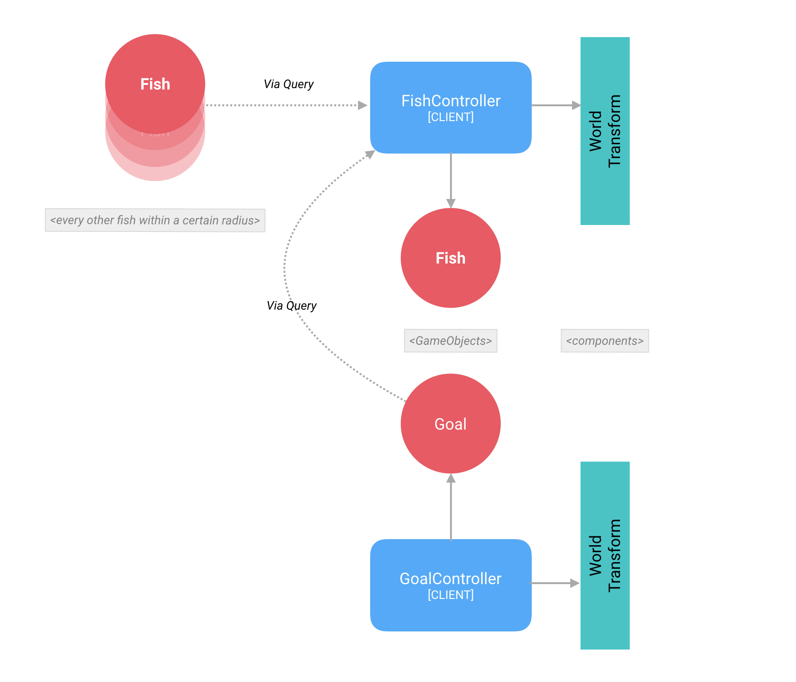

# Swarm Tutorial (built on top of SpatialOS)
---


*GitHub Repository*: [https://github.com/ananda13/swarm](https://github.com/ananda13/swarm)

---

## Introduction

This is a tutorial on how to setup a swarm simulation using [spatialOS](https://spatialos.improbable.io/), which is created by Improbable.

Disclaimer: I am not a spatialOS expert, but a simulation enthusiast, and the intent of the tutorial is to understand how to build large scale simulations with SpatialOS, with the bulk of the computation (physics) running on the cloud. The additional advantage is that you can have multiple users log into it, to view or interact with the simulation

In this tutorial, we will set up a VR enabled (HTC Vive) simulation of a swarm.


## Contents

### Part I   : Basics & Boids
### Part II  : Plug Into Improbable
### PART III : Get Into VR

<br />
<br />

## PART I
### Basics & Boids

#### Getting Started

Skills required: 

a. Basic Unity/C#

b. SpatialOS

You will need to familiarize yourself with the basics of SpatialOS, which is a key component of this tutorial.
They have excellent starter tutorials [here](https://spatialos.improbable.io/docs/reference/10.1/tutorials/showcase)

If you have a basic grasp of Unity, and know nothing about SpatialOS, I would suggest jumping in and trying it. I'm not a Unity expert, and it took me a few days to build this; and I'm sure you can too!

<br />
<br />

*SWARMS*

So what is a swarm, and why simulate it?

Swarms are really interesting because at a micro level, they follows extremely simple rules, but at a macro level, the effects look very sophisticated and frankly, awe-inspiring!

Just look at these guys:


###### Above: A 'murmuration' of starlings . A poet probably came up with that name. 
###### Murmurations are a more complex subset of flocking or swarming behavior.


<br />
<br />

*BOIDS*
<br />

#### Theory 

Craig Reynold's created the first flocking algorithm, and called the simulated creatures 'boids'. You can read all about it [here](http://www.red3d.com/cwr/boids/)

I've summarized the basic principles below. 

If you have a group of creatures, you need them to form a group, with these 3 basic rules in place:

1. Cohesion

Move each boid towards the average position of the group

2. Alignment

Align the heading of each boid towards the average heading of the group

3. Separation

Steer away from other boids to prevent collision.<br />


I've added a fourth rule, so that the flock has a goal to follow:

4. Goal Seeking

Steer each boid towards an arbitrary goal<br />


You can also add more sophisticated rules such as collision avoidance, goal intelligence, etc<br />
<br />


#### Code

There are many in-depth tutorials on how to build a swarm online. I built the boid behavior based on [this one](https://www.youtube.com/watch?v=eMpI1eCsIyM&t=913s).


I've built a simple flocking example in Unity. You can check out this code in [this repo](https://github.com/ananda13/basic-swarm). You dont, strictly speaking, need to build this in order to proceed, but it does help you understand flocking behavior before you transition to the Improbable way of doing things!

The important section of the codebase are :

A. *globalflock.cs* <br />

This defines the behavior of the goal, and sets up the global variables, such as number of boids, etc<br />


B. flock.cs <br />

Provides all the rules that each entity follows. This is the embodiment of the 4 rules above.<br />

<br />
<br />
<br />

## PART II
### Plug Into Improbable

At this point, if you don't know what Improbable or SpatialOS is, I would highly encourage you to run through their excellent [tutorials](https://spatialos.improbable.io/docs/reference/10.1/tutorials/showcase).

1. [Sign up for their Beta](https://spatialos.improbable.io/get-spatialos)<br />

2. [Setup your machine to run spatialOS](https://spatialos.improbable.io/docs/reference/10.1/getting-started/requirements)<br />

3. [Helloworld tutorial](https://spatialos.improbable.io/docs/reference/10.1/tutorials/helloworld/hello-world) : Get your feet wet by building, running locally and deploying to the cloud.<br />

4. [PiratesTutorial](https://spatialos.improbable.io/docs/reference/10.1/tutorials/pirates/overview) : Understand the basic mechanism of client-server architecture. This is the most important tutorial, and the rest of this tutorial is based off this one.
<br />

Once you're past these (and I would love your feedback on what you thought of these), the following may help you setup a simulation model, as opposed to a game. (We will gamify and add VR to this sim later!)
<br />

The code is on GitHub here. Please check out the [tag v0.1](https://github.com/ananda13/swarm/releases/tag/v0.1), if you want to start with some basics and add on the rest yourself. Otherwise check out the [latest](https://github.com/ananda13/swarm/) [*Recommended*].
<br />

As you have noticed, the client-server architecture underpins any spatialOS setup. SpatialOS will let you create UnityServers and UnityClients on which you can run separate pieces of code. In general if you need a window into the world, or need to control anything within this world, you'll need a client, otherwise, everything runs on the server side. The advantage of using SpatialOS, is that now you can run hundreds of thousands of entities in a swarm, and spatialOS will manage all the underlying complexity, and make it work like magic. 

Reality scale simulation. That's pretty cool!

Now, onto the fun stuff. Lets get a swarm going.
<br />

#### Control Flow for Boids (server)
Each swarming entity in the system is called a boid, and in this tutorial, I have a model of a fish, with corresponding animation of it swimming, which we will use for the visuatlization. You can replace this with a dragon, drone or a daikon radish.

We need 2 main entities, and their corresponding components:
 * Fish (FishEntityTemplate.cs)
 	* WorldTransform : To denote the position of each boid. I've modified the standard WorldTransform.schema file to include a speed component as well, since each boid needs to know the speed of it's neighbors to participate in swarming behavior
	* FishParameters : The total number of fish, initial speed, and volume of the tank (i.e. the volume of space over which they will be active) 
 * Goal (SwarmGoalEntityTemplate.cs)
 	* WorldTransform : Each fish needs to know where the goal is, to be able to react to it.
	* GoalParamters : Tank volume, and speed at which it moves.
 
There will be corresponding entity prefabs for fish and goal to which the model, animation, and corresponding scripts have been attached. You can find them in Assets/EntityPrefabs.

Overall, this architecture can be summed up as:

<br />

##### FishController
Every frame, it checks to see how many fish there are around, within a certain radius (denoted by neighborDistance). Similarly it find where the goal entitiy is, and then applies swarming behavior based on the position and speed of those entities. 
We use [spatial queries](https://spatialos.improbable.io/docs/reference/10.1/workers/unity/querying-world), to gather the information about neighboring fish and goal.
<br />

##### GoalController
The goal controller simply moves the goal about to an arbitatry position within the tank volume, at a constant speed. It stays at a position for a random period of time, and then moves on. This provides the random movement of the flock. You can, ofcourse tailor its motion to whatever you want, and the swarm will try to follow it.
<br />

<br />

#### Setup
<br />

Modify spatialOS.json in your project root directory as follows (*this is a critical step*):

* Change the "name" to your account name provided by Improbable
* Change both the "sdk_version" & "version" to the SpatialOS SDK version to the one you are using (e.g. "10.1.1")
If you are *not* on the same SDK version that this project has been written for (at the time of writing it was on 10.x), you will need to follow the upgrade guide to make changes to the code. [Instructions here](https://spatialos.improbable.io/docs/reference/10.1/releases/upgrade-guides/how-to-upgrade-10). Please use the upgrade guide from the version you are currently on, and not the one that is linked above.

#### Build
##### Development
<br />

This is a local build, also known as a development build, in spatialOS.

If you're on Windows, use the Improbable drop down menu within the Unity Editor to run these functions, and if you're on Mac, use command line on terminal. In fact, as of the date of writing this, if you dont follow the above convention, you _may_ run into strange compile errors.
<br />

*Mac*:
<br />

```
$ spatial worker build --target=development
```

Launch locally:
```
$ spatial local launch --snapshot=snapshots/default.snapshot 	
```
<br />

*Windows*
<br />

Window > SpatialOS 


 - Window > SpatialOS 
 - Click on Player Target > Development
 - Click on 'Codegen' (If you've changed any .schema files)
 - Improbable > Snapshots > Generate Snapshot Programatically (this executes the file /Assets/Editor/SnapshotMenu.cs)
 - Improbable > Prefabs > Export All Entity Prefabs (this exports all the prefabs in the folder /Assets/EntityPrefabs)
 - Back to the Spatial Menu
 - Click on 'Build'
 - Click on the drop-down 'Run Spatial Locally' > 'Run'
 
 
In a browser window navigate to:
http://localhost:21000/inspector
<br />
You should see something like this:<br />


<br />
<br />


##### Deployment

<br />

*Mac*
<br />

Create the deployment assets, specifically for cloud deployment
```
$ spatial worker build --target=deployment
```

Upload to the cloud (GCP)
```
$ spatial cloud upload <assembly_name> 
```
(You can use something like SwarmSimAssembly)

For example:
```
$ spatial cloud launch SwarmSimAssembly default_launch.json swarm --snapshot=snapshots/initial_world.snapshot 
```

<br />

*Windows*
<br />
 - Window > SpatialOS 
 - Click on Player Target > Deployment
 - Click on 'Codegen' (If you've changed any .schema files)
 - Improbable > Snapshots > Generate Snapshot Programatically (this executes the file /Assets/Editor/SnapshotMenu.cs)
 - Improbable > Prefabs > Export All Entity Prefabs (this exports all the prefabs in the folder /Assets/EntityPrefabs)
 - Back to the Spatial Menu
 - Click on 'Build'
 - Click on 'Spatial upload' > And type in an assemly name, like 'SwarmSimAssembly' > Upload (this uploads the assembly that you generated in the build step, to your spatial account)
 - At the time of writing, there isn't a way to actually launch the deployment from within Unity. You will have to open up a shell, such as PowerShell, navigate to the root folder, and type the following:
 ```
 $ spatial cloud launch SwarmSimAssembly default_launch.json swarm --snapshot=snapshots/default.snapshot
 ```


Check it out:
Open https://console.improbable.io/projects.
<br />


## PART III
### Get Into VR

Up until now you have built a simulation from scratch on top of spatialOS, and have watched it mesmerize you with the simple beauty of swarming behavior, from within the inspector in 2D.

Now we'll plug in a client, that will let you watch from inside the game engine, and then plug in your HTC Vive headset!

If you don't have a VR headset, you can follow the first half of this section to understand how to enable a client viewer, that can move about in the space. If you have a PC-based VR headset, like the HTC Vive or Oculus Rift, the second section will be useful to you.

### A. Client View
---
#### Control Flow For Players In PiratesTutorial

I've been using PirateTutorial as a reference, to build the swarm tutorial. The diagram below illustrates how inputs from the player are handled in the system:


This is a data flow diagram for the PlayerShip entity. Player input (keyboard: WASD,etc) is recorded by the PlayerInput.cs script, which runs on the client only, as denoted by:
```
[WorkerType(WorkerPlatform.UnityClient)]
```
This is then written into the component ShipControls, as defined in schema/improbable/ship/ShipControls.schema

This data is then read, every frame, by ShipController.cs, which modifies the inputs : inputSpeed & inputSteering into targetSpeed & targetSteering. These 2 variables, in turn are read by ShipMovement.cs, and it is applied to the 3D model of the ship.

These 3 scripts: *PlayerInput.cs, ShipController.cs & ShipMovement.cs* are attached to the GameObject PlayerShip (and hence the prefab).

Using a similar architecture, we create a Player prefab for our simulation, which represents the user who has logged in to view (and possibly interact) with the simulation.


#### Control Flow In The Swarm

The control flow used here is very similar to that of the PiratesTutorial. We use an FPS-like client, i.e. one that can be controlled by WASD + mouse:


PlayerMovement uses the inputs that it reads from PlayerControls component, and translates the Player gameobject accordingly:
```
transform.Translate(PlayerControlsReader.Data.keyHorizontal * Time.deltaTime, 0.0f, PlayerControlsReader.Data.keyVertical * Time.deltaTime);
```
It then writes this position and orientation information (speed is not important for players) to the WorldTransform component, so that other entities can visualize this player if they want. Or not.

We do not need a ShipController to modify the inputs, but we need a secondary controller, CameraRotationController, that applies the inputs from the mouse to move the camera's rotation and is attached to the Player gameobject.


#### Spawning Players

In order to be able to inject a player into the simulation, we need to spawn them in, using a PlayerSpawnManager. Everytime a player connects, the bootstrap.cs script (on the client side), connects to the PlayerSpawner, and requests it to spawn a new player, and returns it's entity id.


We need to add the following entities+components, to enable this:

- Player Spawner : This allows spatial to manage all incoming connections and assign them gameobjects
	- WorldTransform : to know where it it
	- Spawner : to request gameobjects (camera) be spawned for the connecting client


- Player : The entity that embodies each player
	- WorldTransform : to know where in space it is
	- PlayerLifecycle : to keep track of when this player disconnects, by tracking a 'heartbeat'
	- PlayerControls : to get inputs from the player, in order to move their camera
	
This allows the PlayerSpawner (which is created on boot) to spawn players, as they connect.


This being SpatialOS, you can have hundreds of people log into the experience, out of the box! We will start with one, but will build the base that will allow any number of players to join in.
Later you can build any interaction in conjunction with multiplayer, and bring about very complex behaviors.

Note: The structure of component-entities will change somewhat once we introduce VR, but it's good to learn about different architectures.


You can find the new schemas for the components in Swarm/schema/improbable/player/

Next, we setup the EntityTemplates that make up the entities. We create the following EntityTemplates:

	- PlayerEntityTemplate (similar to the PlayerShipEntityTemplate in PiratesTutorial)
	
	```
	playerEntityTemplate.Add(new WorldTransform.Data(new WorldTransformData(initialPosition, playerInitialRotation, 0)));
	playerEntityTemplate.Add(new PlayerLifecycle.Data(new PlayerLifecycleData(0, 3, 10)));    	
	playerEntityTemplate.Add (new PlayerControls.Data (new PlayerControlsData (0, 0, 0, 0)));
	```
	
	We make sure that the WorldTransform and PlayerControls can be accessed by the Unity Client


	- PlayerSpawnerEntityTemplate (identical to the PlayerSpawnerEntityTemplate in PiratesTutorial)
	It's important to attach the Spawner component to this entity.
	```
	playerSpawner.Add(new Spawner.Data(new SpawnerData()));
	```
	

We also add the following scripts to Assets/Gamelogic/Player/Behaviors:

	- PlayerInputController : This takes inputs from the player (in this case, using the mouse and keyboard WASD to control the motion of the player), and updates the PlayerControls component
	
	- PlayerMovement & CameraRotationController : These together receive the component updates of PlayerControls and move the Player gameobject and associated camera
	
	- PlayerSpawnManager : This is attached to the PlayerSpawner prefab, and contains callbacks that are invoked when a new player requests to join the simulation. This spawns the new player and gives them controls to look around and move.

	- PlayerHeartbeatSender : This sends heartbeats (HBs) ever so often (determined by the playerHeartbeatInterval), which is received by the PlayerEntityLifeCycleManager (below) to determine, which player is unresponsive, and kicking them out.

	- PlayerEntityLifeCycleManager : This checks to see if new HBs are coming in from any player, and if it reaches the threshold of missed heartbeats, it deletes the player.


We also need to modify *Assets/Bootstrap.cs*, and the modifications are identical to the file in PiratesTutorial and it is how the Unity Client (any player logging in) uses to connect to the simulation. This script first finds the PlayerSpawner, and then requests PlayerSpawner to create a new Player and inject them into the simulation at the designated coordinates (defaulted to (0,0,0))

At this point you can build, and run the simulation locally. Once that is successful, open the project in Unity and play the CLientScene. You should see something like this:
<br />


Thereafter, build for deployment, create assembly and launch into the cloud, and use the Improbable Launcher to log into client view.
<br />
<br />


#### B. Adding SteamVR

At this point, you may want to check out the latest code from this repo, as it has all the SteamVR changes. In order to allow SteamVR to take over the camera, we need to make a few changes:
1. 

- PlayerVR (prefab)
	- VRPlayerMovement.cs : This replaces PlayerMovement.cs, and reads the inputs from SteamVR and writes those to the WorldTransform component. In Start(), it checks to make sure the [CameraRig] object (default SteamVR prefab name) is available on this GameObject. You can do this by making the [CameraRig] prefab, a child of the an empty gameobject, called PlayerVR, and making that a prefab. We only enable SteamVR camera if it is attached to this player. This is a safeguard that prevents clients from running steamVR when theyre not supposed to. 
	
	- PlayerSpawnManager.cs : Change the name of the prefab to spawn to "PlayerVR" instead of "Player"
	
	- Add #ifdefs to the following files, to prevent SteamVR from being active on the Server side (linux). You can find the references in [this forum thread](https://forums.improbable.io/t/enabling-steamvr-on-client-only/1872/3)
		- SteamVR.cs:
		- SteamVR_Camera.cs:
	
	- Add Teleport capability : This is done quite easily by adding the following scripts to either, or both, of your controllers:
		- SteamVR_LaserPointer.cs
		- SteamVR_Teleporter.cs


### Optimizing Workers

We will need to optimize the workers for the way the world is designed and the special needs of a swarm. With the way spatialOS distributes load across workers, is spatially! Of course this comes with the assumption that load is spread out on average spatially. However, this is not true for swarms, as they can cluster heavily in one region, and overload the Unity worker. This can result is freezing motion, or the unity worker completely giving up.
One workaround for this, which Im still fine-tuning, is to have more workers cover less ground each, so that as the swarm moves through the area, it is already getting split between multiple workers. This will also stress test how handoffs happen between adjacent workers. This is not an ideal workaround, and if you find better ways of managing this, please drop me a line, Id like to learn more as well.


<br />

<br />

<br />

<br />

## Stay In Touch

Follow Ando on [Twitter](https://twitter.com/andoshah)<br />

Follow changes on [GitHub](https://github.com/ananda13/swarm)<br />

Follow the [Improbable Forum](https://forums.improbable.io/)<br />


Let me know if you've made a simulation with Spatial! I'd love to see it!<br />
<br />


## Future

I'm taking up the swarm project, and building a multi-user art-science experiment where players will be able to _try_ to control swarms of different creatures (from starlings to drones!) on islands floating in the sky. In VR (duh)!
<br />

If you're interested in contributing, either with code, art or ideas, feel free to drop me a line.
<br />

Love & Cheers,

Ando
